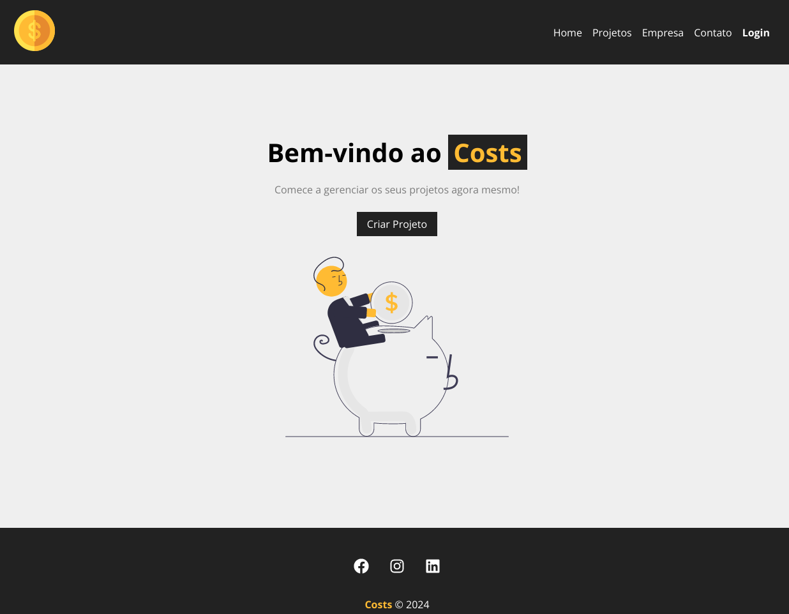
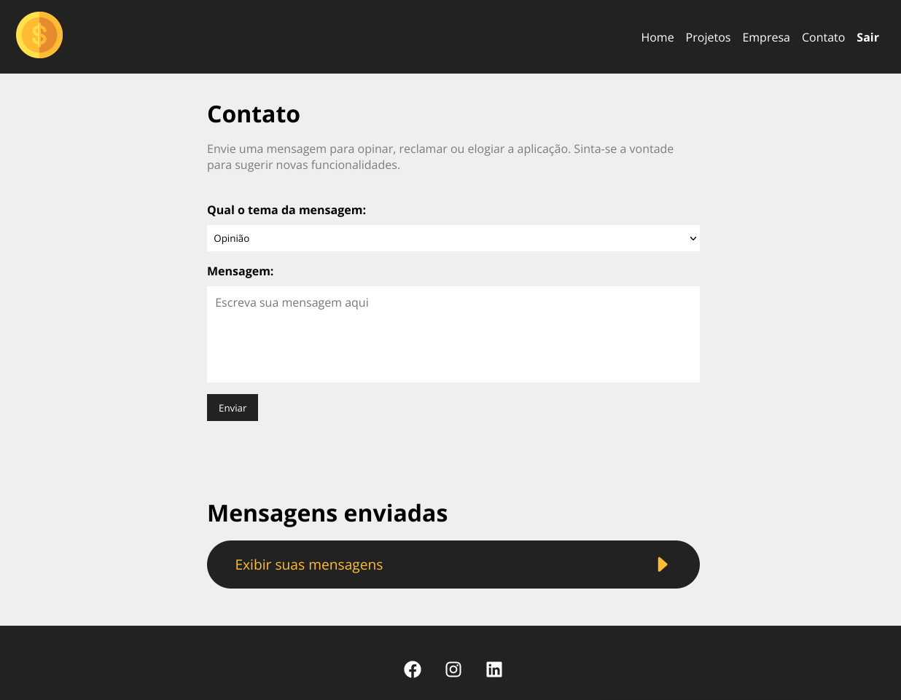

<h1 align="center"> Costs </h1>

O <strong>Costs</strong> é um gerenciador de projetos.

  <a href="#-projeto">Projeto</a>&nbsp;&nbsp;&nbsp;|&nbsp;&nbsp;&nbsp;
  <a href="#-instalação">Instalação</a>&nbsp;&nbsp;&nbsp;|&nbsp;&nbsp;&nbsp;
  <a href="#-tecnologias">Tecnologias</a>&nbsp;&nbsp;&nbsp;|&nbsp;&nbsp;&nbsp;
  <a href="#memo-licença">Licença</a>

  

 

## 💻 Projeto

Esse projeto foi baseado no Curso de React do **[Hora de Codar](https://youtube.com/playlist?list=PLnDvRpP8BneyVA0SZ2okm-QBojomniQVO&si=YzJ-gxcxd5MgecJk)**.

Além do projeto base, foi implementado uma página de **Login** e uma página de **Contato**. A página de contato se comporta de maneira diferente quando logado. Com essas novas funcionalidades pude praticar os conhecimentos adquiridos durante o curso e utilizar novas ferramentas. Alguns dos conceitos utilizado são:

- Os hooks: useState, useEffect, useContext e useNavigate;
- fetch API;
- Renderização condicional e Renderização de listas;

### A página de Contato quando logado

  

## :gear: Instalação

Para rodar essa aplicação é encessário ter previamente o **node** instalado em sua máquina.

Entre na pasta do projeto e execute o comando

  npm i

Depois execute os dois comandos (pode-se executá-los em dois terminais diferentes):

  npm run backend
  npm start

O projeto será aberto automaticamente no seu navegador padrão.

## 🚀 Tecnologias

- HTML e CSS
- JavaScript
- React

## :memo: Licença

Esse projeto está sob a licença MIT.
